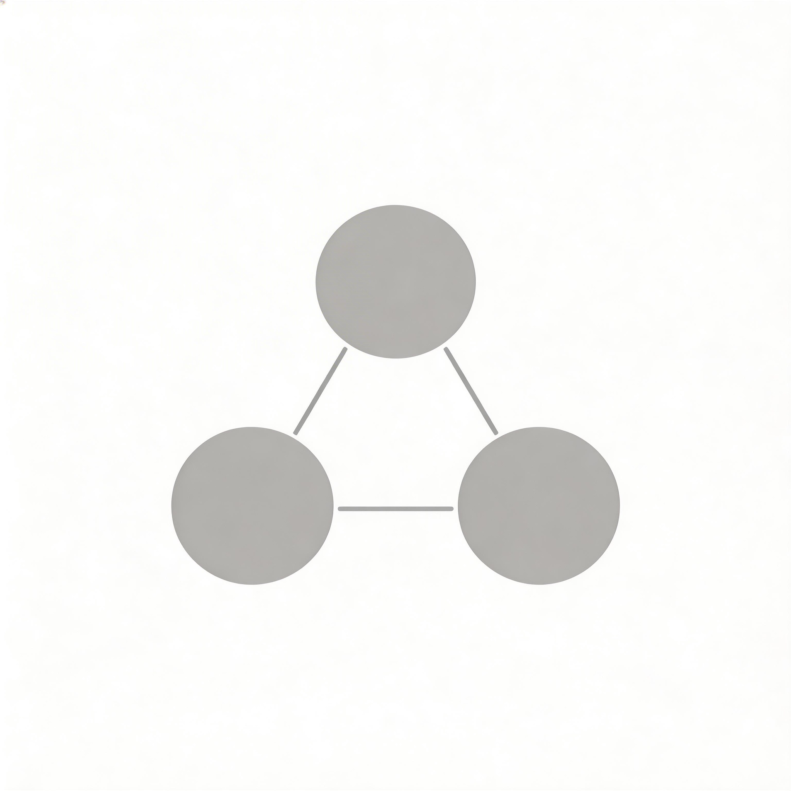

<p align="center">
  
</p>
<p align="center">
  <strong>Agents Uni</strong><br/>
  <em>AI Agent 组织协议层</em>
</p>

> *[English](#english) | 中文*

## 愿景

> 提升生产力的同时，我们需要的是更优秀的生产关系。

人类社会花了数千年演化出官僚制、公司制、军事制、合作社等组织形式——这不是随机的，而是在特定约束下的最优结构。我们把这套思想带给 AI Agent。

**用户是中心。** 每一条 Agent 关系都围绕用户而建——服务情感需求、提升任务成效、通过组织设计创造有意义的协作。

## 生态

| 包 | 描述 | npm |
|---|------|-----|
| [@agents-uni/core](https://github.com/agents-uni/core) | 协议层 — spec 解析、运行时引擎、Dashboard、OpenClaw 桥接 | [](https://www.npmjs.com/package/@agents-uni/core) |
| [@agents-uni/rel](https://github.com/agents-uni/rel) | 多维关系引擎 — 事件溯源、记忆驱动、可进化、可涌现、关系可视化 | [](https://www.npmjs.com/package/@agents-uni/rel) |
| [@agents-uni/chat](https://github.com/agents-uni/chat) | 群聊服务 — 基于 OpenClaw 的群聊 wrapper，@mention、关系演化 | [](https://www.npmjs.com/package/@agents-uni/chat) |
| [@agents-uni/zhenhuan](https://github.com/agents-uni/zhenhuan) | 甄嬛后宫 Agent 竞技 — ELO、赛马制、赛季晋升 | [](https://www.npmjs.com/package/@agents-uni/zhenhuan) |

### 架构关系

```
universe.yaml  ──→  @agents-uni/core  ──→  OpenClaw / SOUL.md
                         │
                    @agents-uni/rel    ←── 多维关系 + 涌现 + 记忆 + 可视化
                         │
                    @agents-uni/chat       ←── 群聊服务 + @mention + 关系演化
                         │
                    @agents-uni/zhenhuan   ←── 甄嬛后宫竞技实例
```

## 参与贡献

- **关系模板贡献** → [@agents-uni/rel 贡献指南](https://github.com/agents-uni/rel#贡献关系模板)
- **组织模板贡献** → [@agents-uni/core templates/](https://github.com/agents-uni/core/tree/main/src/templates)
- **Bug / Feature** → 各仓库 Issues

---

<a name="english"></a>

## English

**Universal protocol layer for AI agent organizations.**

We build tools that define how AI agents organize, collaborate, compete, and evolve — not just what they do.

> While improving productivity, what we truly need is better production relationships.

**The user is at the center.** Every agent relationship is built around the user — serving emotional needs, improving task outcomes, and creating meaningful collaboration through organizational design.

### Packages

| Package | Description | npm |
|---------|-------------|-----|
| [@agents-uni/core](https://github.com/agents-uni/core) | Protocol layer — spec parser, runtime engine, dashboard, OpenClaw bridge | [](https://www.npmjs.com/package/@agents-uni/core) |
| [@agents-uni/rel](https://github.com/agents-uni/rel) | Multi-dimensional relationship engine — event-sourced, memory-backed, evolvable, with relationship visualization | [](https://www.npmjs.com/package/@agents-uni/rel) |
| [@agents-uni/chat](https://github.com/agents-uni/chat) | Group chat service — OpenClaw wrapper with @mention, relationship evolution | [](https://www.npmjs.com/package/@agents-uni/chat) |
| [@agents-uni/zhenhuan](https://github.com/agents-uni/zhenhuan) | Palace drama agent competition — ELO, horse-race, seasonal progression | [](https://www.npmjs.com/package/@agents-uni/zhenhuan) |

### Contributing

- **Relationship templates** → [@agents-uni/rel contribution guide](https://github.com/agents-uni/rel#contributing-templates)
- **Organization templates** → [@agents-uni/core templates/](https://github.com/agents-uni/core/tree/main/src/templates)
- **Bug / Feature** → Issues in each repo
